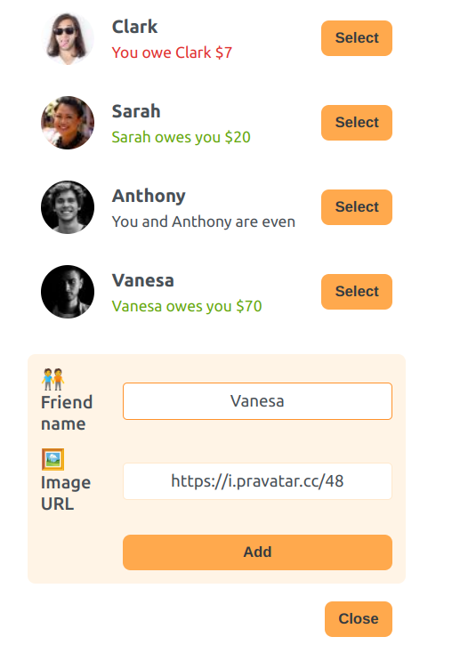
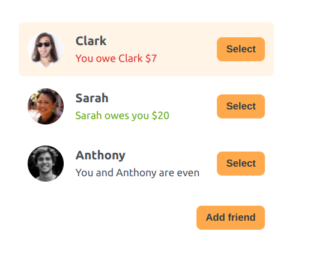
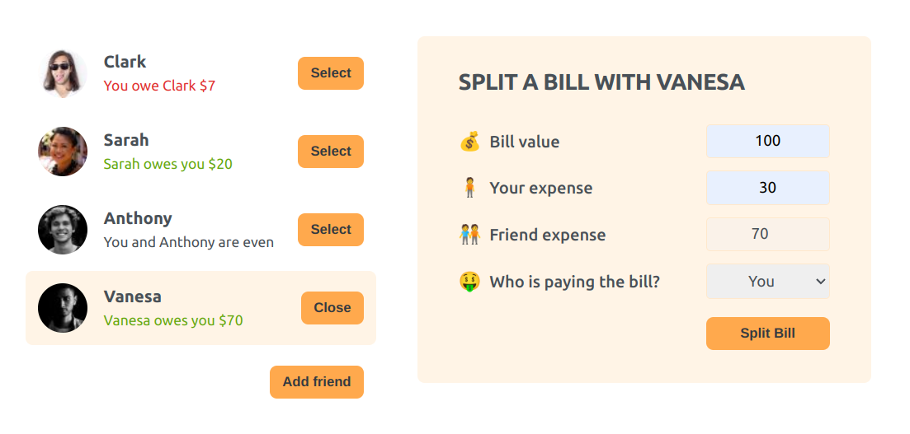

# Eat-n-split

## Table of Contents
- [Overview](#overview)
- [Built With](#built-with)
- [Features](#features)
- [Acknowledgements](#acknowledgements)

## Overview
- Simple app which allows users to split bills after going out with friends or when sharing costs in general.
- It was built with React using Create React App.
- You can try it out at [Vercel - Eat-n-split](https://eat-n-split-gilt.vercel.app/)

### Concepts applied
- JSX
- Components
- Props
- Rendering lists
- Conditional rendering
- Destructurating props
- React fragments
- State
- Events handling
- Forms
- React developer tools
- Update State
- Controlled Elements
- Lifting State Up
- Data flow
- Child-to-parent communitation
- Derived State
- Sorting Items
- children prop

## Features
- Very simple application, where users can split theirs bills.
- The app allows add new friends or contacts to the list.

- The list keep a balance of the user with each of the friends.

- Then a friend can be selected to share the bill with.
- According to who paid the bill, the app will calculate the balace.

## Acknowledgements
This project is part of The Ultimate React Course 2023: React, Redux & More by [Jonas Schmedtmann](http://jonas.io/).